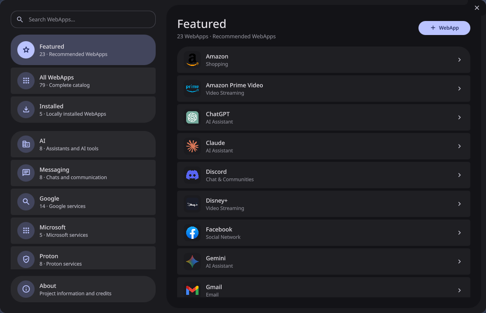
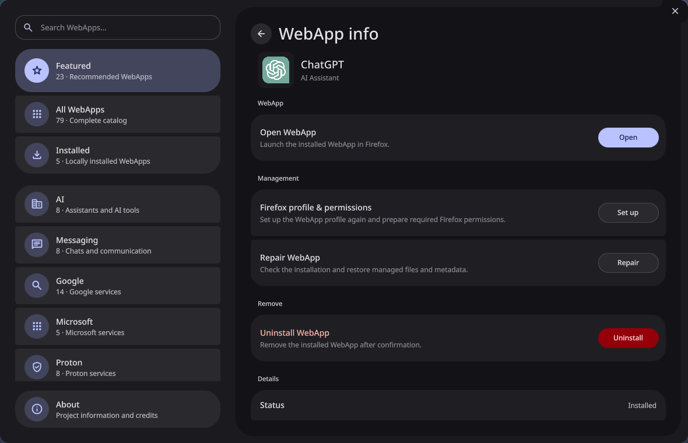

# Caelestia WebApps 0.4.1

[](https://github.com/psdl76/caelestia-shell-installer/releases/latest)
[](LICENSE)

Caelestia WebApps is a standalone Firefox WebApp manager for Hyprland. Its
navigation, motion and visual grouping are designed to feel at home next to the
Caelestia Shell Nexus settings UI.

| Catalog | WebApp actions |
| --- | --- |
|  |  |

> [!IMPORTANT]
> Caelestia WebApps is an unofficial community project. It is not affiliated
> with or maintained by the Caelestia Shell or Hyprland projects.

Release 0.4.1 adds accepted German/English localization to the Phase 16.8
lifecycle and Phase 17.7 Manager baseline. Its real install/uninstall lifecycle
has passed without a Hyprland monitor reload. The project is licensed under
GPL-3.0-only.

## Highlights

- catalog of built-in and user-defined WebApps;
- isolated Firefox profiles and Hyprland integration;
- install, launch, setup, repair and uninstall lifecycle through a stable CLI;
- optional Caelestia TopBar applets and persistent capability settings;
- standalone QML/Quickshell Manager with Nexus-style navigation and motion;
- WebApp detail pages, add/edit wizard, confirmation flows and About page;
- keyboard navigation, live runtime state and Caelestia-derived public palette
  bridge without private Caelestia QML imports.
- automatic German/English Manager localization with an explicit language
  override;
- reload-free app rule updates for current Hyprland Lua configurations.

## Install

### Rootless release install

Install the required software listed below, then download and install the
current release into `~/.local`:

```bash
curl -LO https://github.com/psdl76/caelestia-shell-installer/releases/download/v0.4.1/caelestia-webapps-0.4.1.tar.gz
tar -xzf caelestia-webapps-0.4.1.tar.gz
cd caelestia-webapps-0.4.1
./packaging/install-core.sh
~/.local/bin/caelestia-webapps-manager
```

The package installer replaces only package-owned Core files. WebApps, Firefox
profiles, settings and runtime state remain user-owned and survive upgrades or
Core removal.

An AUR package named `caelestia-webapps` is being prepared.

## Requirements

- Arch Linux or a compatible userspace
- Hyprland
- Quickshell
- Firefox
- Bash and Python 3

## Run from a source checkout

```bash
./manager.sh
```

The Manager performs its preflight, refreshes Catalog v2 through
`bin/caelestia-webapps` and then opens the standalone Quickshell window.

German is selected for `de` locales; all other locales use English. To override
the detected locale for one launch:

```bash
CAELESTIA_WEBAPPS_LANGUAGE=de ./manager.sh
CAELESTIA_WEBAPPS_LANGUAGE=en ./manager.sh
```

## Architecture

- CLI JSON API: v1
- catalog schema: v2
- applet registry schema: v1
- Manager-to-engine calls always use argument lists
- user definitions and persistent runtime settings remain outside package-owned
  source files
- plugin and standalone code do not import private Caelestia APIs

## Support and contributions

- Report reproducible problems through
  [GitHub Issues](https://github.com/psdl76/caelestia-shell-installer/issues).
- Include the app ID, action, expected result and relevant command output.
- Do not attach Firefox profiles, tokens, cookies or other private runtime data.
- Contributions should preserve the stable CLI boundary and the frozen
  lifecycle contracts documented under `docs/`.

## Validation

The complete accepted product gate is:

```bash
bash tests/run_phase18_2_gate.sh
```

It includes the Phase 17 Manager suite, the 22-test Phase 16.8 lifecycle gate,
shell syntax validation and the 17-test packaging/product gate. Destructive
lifecycle tests run in disposable HOME/XDG environments.

The local 0.4.1 release gate, including artifact builds, is:

```bash
bash tests/run_release_0_4_1_gate.sh
```

## Packaging and licensing

The project and packaged source are licensed under GPL-3.0-only. The desktop
entry intentionally uses the generic `applications-internet` icon. The
canonical repository is
[psdl76/caelestia-shell-installer](https://github.com/psdl76/caelestia-shell-installer).

See `docs/phases/phase-18/PHASE18_1_MANAGER_LOCALIZATION.md`,
`docs/phases/phase-18/PHASE18_2_RELOAD_FREE_HYPRLAND.md` and
`docs/releases/RELEASE_0.4.1.md` for the accepted baseline and release notes.
