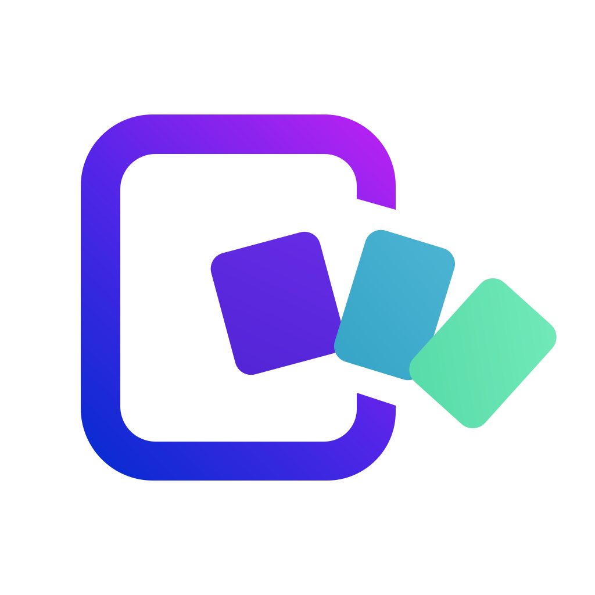

# Caelestia WebApps 0.4.3

<p align="center">
  
</p>

[](https://github.com/psdl76/caelestia-shell-installer/releases/latest)
[](LICENSE)

Caelestia WebApps is a standalone Firefox WebApp manager for Hyprland. Its
navigation, motion and visual grouping are designed to feel at home next to the
Caelestia Shell Nexus settings UI.

| Catalog | WebApp actions |
| --- | --- |
|  |  |

> [!IMPORTANT]
> Caelestia WebApps is an unofficial community project. It is not affiliated
> with or maintained by the Caelestia Shell or Hyprland projects.

Release 0.4.3 is a focused stability update for the accepted German/English
Manager and lifecycle baseline. It hardens atomic Hyprland configuration
updates, lifecycle conflict handling and reproducible release packaging while
preserving the standalone public-API boundary. The project is licensed under
GPL-3.0-only.

## Highlights

- catalog of built-in and user-defined WebApps;
- isolated Firefox profiles and Hyprland integration;
- install, launch, setup, repair and uninstall lifecycle through a stable CLI;
- recovery of installed WebApp remnants whose former catalog definition is no
  longer available;
- optional Caelestia TopBar applets and persistent capability settings;
- standalone QML/Quickshell Manager with Nexus-style navigation and motion;
- WebApp detail pages, add/edit wizard, confirmation flows and About page;
- keyboard navigation, live runtime state and Caelestia-derived public palette
  bridge without private Caelestia QML imports.
- automatic German/English Manager localization with an explicit language
  override;
- reload-free app rule updates for current Hyprland Lua configurations.

## Install

### Rootless release install

Install the required software listed below, then download and install the
current release into `~/.local`:

```bash
curl -LO https://github.com/psdl76/caelestia-shell-installer/releases/download/v0.4.3/caelestia-webapps-0.4.3.tar.gz
tar -xzf caelestia-webapps-0.4.3.tar.gz
cd caelestia-webapps-0.4.3
./packaging/install-core.sh
~/.local/bin/caelestia-webapps-manager
```

The package installer replaces only package-owned Core files. WebApps, Firefox
profiles, settings and runtime state remain user-owned and survive upgrades or
Core removal.

An AUR package named `caelestia-webapps` is being prepared.

## Requirements

- Arch Linux or a compatible userspace
- Hyprland
- Quickshell
- Firefox
- Bash and Python 3

## Run from a source checkout

```bash
./manager.sh
```

The Manager performs its preflight, refreshes Catalog v2 through
`bin/caelestia-webapps` and then opens the standalone Quickshell window.

German is selected for `de` locales; all other locales use English. To override
the detected locale for one launch:

```bash
CAELESTIA_WEBAPPS_LANGUAGE=de ./manager.sh
CAELESTIA_WEBAPPS_LANGUAGE=en ./manager.sh
```

## Using the Manager

### Install a catalog WebApp

1. Select an application from Featured, All WebApps or one of the catalog
   categories.
2. Choose **Install**. This creates the dedicated Firefox profile, launcher,
   desktop entry and managed Hyprland integration.
3. On the WebApp information page, choose **Set up** before opening the app for
   normal use.

The setup step is important on every first installation. Each WebApp uses its
own isolated Firefox profile, so permissions from your regular Firefox profile
are not shared. Setup temporarily shows Firefox's navigation and permission UI
so the site can request access to features such as microphone, camera and
notifications. Grant only the permissions you want, then close the setup
window. Future launches use the compact WebApp view with the saved permissions.

If the WebApp is already running, close it completely before selecting **Set
up**. The Manager intentionally avoids changing the profile UI underneath a
running Firefox process.

### Create your own WebApp

Select **+ WebApp** to add any suitable `http://` or `https://` service that is
not included in the built-in catalog. Enter a name and URL, choose the closest
category, and select one of the available icon sources:

- automatic icon lookup by App ID;
- a direct HTTPS icon URL;
- a local SVG or PNG file.

Creating the entry adds a persistent user-owned catalog definition; it does not
install the WebApp immediately. Open the new entry, choose **Install**, and then
run **Set up** once for that isolated Firefox profile. User-created entries can
later be edited, repaired, uninstalled or removed from the local catalog. They
remain outside the package-owned Core and therefore survive Core upgrades.

## Architecture

- CLI JSON API: v1
- catalog schema: v2
- applet registry schema: v1
- Manager-to-engine calls always use argument lists
- user definitions and persistent runtime settings remain outside package-owned
  source files
- plugin and standalone code do not import private Caelestia APIs

## Support and contributions

- Report reproducible problems through
  [GitHub Issues](https://github.com/psdl76/caelestia-shell-installer/issues).
- Include the app ID, action, expected result and relevant command output.
- Do not attach Firefox profiles, tokens, cookies or other private runtime data.
- Contributions should preserve the stable CLI boundary and the frozen
  lifecycle contracts documented under `docs/`.

## Validation

The complete accepted product gate is:

```bash
bash tests/run_phase18_2_gate.sh
```

It includes the Phase 17 Manager suite, the 26-test Phase 16.8 lifecycle gate,
shell syntax validation and the 17-test packaging/product gate. Destructive
lifecycle tests run in disposable HOME/XDG environments.

The local 0.4.3 release gate, including reproducible artifact builds and a
rootless install/uninstall from the extracted release archive, is:

```bash
bash tests/run_release_0_4_3_gate.sh
```

## Packaging and licensing

The project, packaged source and project-owned branding are licensed under
GPL-3.0-only. The desktop entry uses the scalable `caelestia-webapps` project
icon. The canonical repository is
[psdl76/caelestia-shell-installer](https://github.com/psdl76/caelestia-shell-installer).

See `docs/phases/phase-18/PHASE18_1_MANAGER_LOCALIZATION.md`,
`docs/phases/phase-18/PHASE18_2_RELOAD_FREE_HYPRLAND.md` and
`docs/releases/RELEASE_0.4.3.md` for the current release notes.
